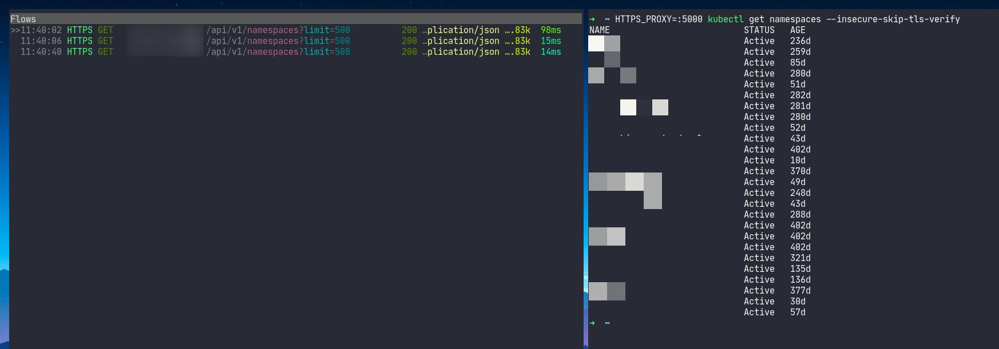

# Intercepting Kubectl Requests with mitmproxy

Whenever we do `kubectl ..`, the commands are converted to HTTP requests and they are sent to the [Kube api-server](https://kubernetes.io/docs/reference/command-line-tools-reference/kube-apiserver/). That also means that we could use [mitmproxy](https://mitmproxy.org/) to intercept the requests and responses.

```bash
# start mitmproxy listening at port 5000 with --ssl-insecure flag
mitmproxy -p 5000 --ssl-insecure

# run kubectl with HTTPS_PROXY and --insecure-skip-tls-verify flag
HTTPS_PROXY=:5000 kubectl get namespaces --insecure-skip-tls-verify
```

We should see something like this.

